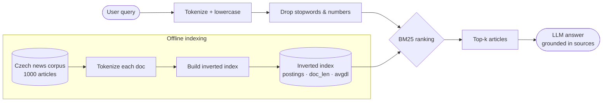
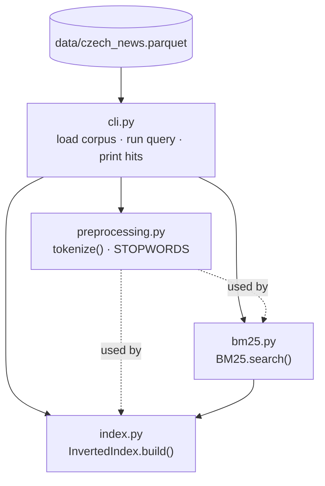

# Design — Czech News Retrieval

Design notes: the pipeline, the code structure, and the
**why** behind each NLP choice. Diagrams are Mermaid so they render directly on
GitHub.

---

## 1. Retrieval pipeline (query → ranked results → answer)

**Reading it:** the bottom box is built **once** (offline) — we tokenize every
article and build the inverted index. At **query time** (top row) we tokenize the
query the *same way*, let BM25 score only the documents that share a term, and
return the top-k. The final step hands those articles to an LLM to synthesize a
grounded answer — this is the RAG (Retrieval-Augmented Generation) layer.

> Key principle: **query and documents must go through the identical
> preprocessing.** If we lowercase + drop stopwords for docs but not for the
> query (or vice-versa), terms won't match.

---

## 2. Code components

Small, single-responsibility modules. `cli.py` is the only place that knows
about pandas/the file; the retrieval core (`preprocessing`, `index`, `bm25`) is
pure Python and easy to unit-test.

---

## 3. NLP choices & rationale

| Decision | Choice (v1) | Why | Future lever |
|---|---|---|---|
| **Tokenization** | regex `\w+`, lowercased | Unicode `\w` already matches Czech diacritics (á, č, ř); simple & dependency-free | subword / proper sentence segmentation |
| **Stopwords** | small starter Czech set | very common words (a, v, na, se…) add noise, little topical signal | fuller list; measure impact in eval |
| **Diacritics** | **preserved** | folding (č→c) boosts recall but hurts precision; keep for now, decide with numbers | configurable fold + measure |
| **Lemmatization** | **none yet** | Czech is highly inflected ("povodeň/povodně/povodní"); lemmatizing folds forms together → big recall win, but adds a dependency | add `simplemma`, measure before/after |
| **Scoring** | **Okapi BM25 (own impl)** | industry-standard lexical ranker; handles TF saturation + length normalization — both motivated directly by our EDA | tune k1/b; field weighting |
| **BM25 params** | k1=1.5, b=0.75 | standard defaults; b<1 = partial length normalization (we saw 44× length spread in `content`) | grid-search against eval set |
| **Indexed fields** | headline + brief + content (concatenated) | recall on both titles and body | weight headline higher (titles are dense signal) |

---

## 4. Known limitations (honest, from the first run)

- **No lemmatization** → inflected query forms can miss matching docs.
- **Single rare term over-weighted** → e.g. "liga" alone surfaces *"Liga proti
  rakovině"* (high IDF, no sense disambiguation).
- **No phrase / proximity** → "fotbal liga" scores the two terms independently.
- **Diacritics strict** → a query without diacritics won't match accented text.

Each of these is a concrete, measurable improvement — see `EVALUATION.md` for how
we'll quantify them rather than guess.
