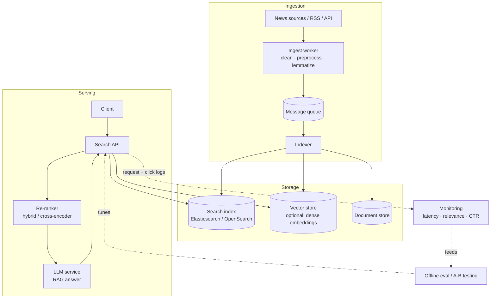

# Czech News Search — BM25 retrieval + RAG

A full-text search engine over a corpus of Czech news articles, built around an
**own from-scratch BM25 implementation** and a Czech NLP preprocessing pipeline,
with a real evaluation methodology and an LLM (RAG) answer layer on top.

---

## What it does

```
query --> Czech preprocessing --> BM25 over an inverted index --> ranked articles
                                                                       │
                                                          (optional) RAG answer:
                                                  top-k articles --> Claude --> grounded answer with sources
```

Three things you can run:

| Command | What it does |
|---|---|
| `uv run czech-news-search "vláda rozpočet"` | ranked article search (BM25) |
| `uv run python scripts/evaluate.py` | evaluate retrieval (P@k, MRR, nDCG) |
| `uv run czech-news-answer "Co se psalo o očkování?"` | RAG: retrieve + LLM answer with sources |

---

## How to run

Requires [`uv`](https://docs.astral.sh/uv/). Python 3.12 is fetched automatically.

```bash
uv sync                                   # create env + install deps
uv run python scripts/download_dataset.py # fetch corpus -> data/czech_news.parquet
uv run czech-news-search "fotbal liga"    # search
uv run python scripts/evaluate.py         # metrics
uv run czech-news-answer "Co se dělo na Ukrajině?"   # RAG answer (needs Claude CLI)
```

The RAG step calls the **Claude CLI** (`claude -p`) so it runs on an existing
Claude subscription — no API key. Swap it for a hosted model in production.

---

## Approach & key decisions

Full reasoning with diagrams in [`DESIGN.md`](DESIGN.md); evaluation write-up in
[`EVALUATION.md`](EVALUATION.md). Highlights:

- **Own BM25** (`bm25.py`) — Okapi BM25 with TF saturation (`k1`) and length
  normalization (`b`), both motivated directly by the data (article lengths span
  431–18,893 chars, a 44× spread).
- **Inverted index** (`index.py`) — built from scratch; stores postings, document
  lengths and average length (`avgdl`).
- **Czech NLP** (`preprocessing.py`) — tokenize, stopwords, and `simplemma`
  lemmatization to fold inflected forms (povodně/povodní → povodeň).
- **Evaluation from scratch** (`evaluation.py`) — P@k, MRR, nDCG, with a query set
  seeded from the dataset's `keywords` field.

### Results (18 queries, @k=10)

| Pipeline | P@10 | MRR | nDCG@10 |
|---|---|---|---|
| BM25 baseline | 0.594 | 0.838 | 0.620 |
| **BM25 + lemmatization** | **0.639** | **0.880** | **0.662** |

Lemmatization was a *hypothesis we measured*, not a guess — it won on all three
metrics (~7% relative P@10). See `EVALUATION.md` for the honest caveats.

---

## Production architecture

The prototype is in-memory and single-process (fine for 1000 docs). Scaled up:



**How today's prototype maps onto it:**

| Prototype (this repo) | Production component |
|---|---|
| `InvertedIndex` + `BM25` | Elasticsearch / OpenSearch (BM25 built in) |
| `preprocessing.tokenize` | index-time + query-time analyzer |
| `scripts/download_dataset.py` | streaming ingest worker + queue |
| `rag.py` → `claude -p` | managed LLM endpoint (API / self-hosted) |
| `scripts/evaluate.py` | offline eval pipeline feeding A/B decisions |

**Tradeoffs worth discussing:** Elasticsearch (mature lexical + ops tooling) vs.
a vector DB like Qdrant (semantic recall) vs. a hybrid of both; batch re-indexing
vs. streaming; when an LLM re-ranker / RAG answer is worth the latency and cost.

---

## Honest limitations

- Single-keyword evaluation queries are easier than real natural-language ones;
  keyword tags are a noisy proxy for human relevance judgements.
- No phrase/proximity scoring; multi-word queries score terms independently.
- Diacritics are matched strictly (a query without them won't match accented text).
- Lemmatization occasionally over-folds (helps on average, hurt `brno` slightly).
- In-memory index, rebuilt per run — fine for 1000 docs, not for millions.

## Possible next steps

- Field weighting (boost `headline`), phrase queries, diacritics-folding option.
- Hybrid retrieval: dense embeddings (e.g. `multilingual-e5`) to re-rank BM25 top-N.
- Human-judged / LLM-judged graded relevance set; significance testing.
- Persist the index; expose a small search API.

---

## A note on process

This was built with **AI pair-programming** (Claude Code). The architecture, NLP
and evaluation **decisions — and the reasoning behind them — are my own**; I used
the assistant to move faster on scaffolding and to pressure-test ideas. Everything
in this repo I can explain and defend.

## Repo layout

```
src/czech_news_search/
  preprocessing.py   # tokenize, stopwords, Czech lemmatization
  index.py           # inverted index (postings, doc_len, avgdl)
  bm25.py            # Okapi BM25 from scratch
  evaluation.py      # P@k, MRR, nDCG from scratch
  cli.py             # `czech-news-search` search command
  rag.py             # `czech-news-answer` RAG command
scripts/             # download_dataset.py, evaluate.py
eval/queries.txt     # curated evaluation query set
DESIGN.md  EVALUATION.md
```
